# GhostWriter AI Agent Architecture

```mermaid
graph TB
    Input[📝 User Request<br/>Topic, Style, Platform]
    
    Coordinator[🎯 Coordinator Agent<br/>ghostwriter_agent/agent.py<br/>Task Routing & Orchestration]
    
    subgraph "Planning Phase"
        Trend[📈 Trend Watcher<br/>sub_agents/trend_watcher.py<br/>Market Research & Insights]
        Strategy[📊 Content Strategist<br/>sub_agents/content_strategist.py<br/>Content Planning & Strategy]
    end
    
    subgraph "Creation Phase"
        Creator[✍️ Content Creator<br/>sub_agents/content_creator.py<br/>Writing & Drafting]
        Image[🖼️ Image Generator<br/>sub_agents/image_generator.py<br/>Visual Content Creation]
    end
    
    subgraph "Quality Phase"
        Eval[🔍 Evaluator<br/>sub_agents/evaluator_agent.py<br/>Quality Review & Feedback]
    end
    
    subgraph "Distribution Phase"
        Pub[📤 Publisher<br/>sub_agents/publisher_agent.py<br/>Content Distribution]
    end
    
    Output[✅ Final Content Package<br/>Post + Image + Metadata]
    
    Prompts[📋 Prompts Library<br/>prompts.py<br/>Brand Profiles & Templates]
    Config[⚙️ Configuration<br/>config.py<br/>API Keys & Settings]
    GoogleAI[🤖 Google Generative AI<br/>LLM API & ADK]
    
    Input --> Coordinator
    
    Coordinator --> Trend
    Trend --> GoogleAI
    Trend --> Strategy
    
    Strategy --> GoogleAI
    Strategy --> Creator
    Strategy --> Image
    
    Creator --> GoogleAI
    Creator --> Eval
    
    Image --> GoogleAI
    Image --> Eval
    
    Eval --> GoogleAI
    Eval -->|✓ Pass| Pub
    Eval -->|✗ Fail| Creator
    
    Pub --> Output
    
    Trend -.-> Prompts
    Strategy -.-> Prompts
    Creator -.-> Prompts
    Image -.-> Prompts
    Eval -.-> Prompts
    Pub -.-> Prompts
    
    Coordinator -.-> Config
    
    style Coordinator fill:#ff6b6b,stroke:#c92a2a,color:#fff,stroke-width:3px
    style Eval fill:#ffd43b,stroke:#fab005,color:#000,stroke-width:2px
    style Output fill:#51cf66,stroke:#2f9e44,color:#fff,stroke-width:2px
    style Input fill:#4dabf7,stroke:#1971c2,color:#fff,stroke-width:2px
    style GoogleAI fill:#a78bfa,stroke:#7c3aed,color:#fff
    style Prompts fill:#868e96,stroke:#495057,color:#fff
```




## Technology Stack

### Frontend
- **Framework**: React 18 with TypeScript
- **Build Tool**: Vite (fast dev server, HMR)
- **Styling**: TailwindCSS
- **Auth**: Firebase SDK (Email/Password)
- **State Management**: React Hooks (useState, useEffect, custom hooks)
- **HTTP Client**: Fetch API
- **Routing**: React Router (protected routes)

### Backend
- **Framework**: FastAPI (async Python web framework)
- **Validation**: Pydantic models
- **Server**: Uvicorn (ASGI server)
- **Storage**: File-based JSON (sessions/, scheduled_posts/)
- **Publishing Integrations**: 
  - WordPress REST API
  - Threads API (Meta)
  - Facebook Graph API

### AI Agents
- **LLM**: Google Generative AI (Gemini)
- **Framework**: Google ADK (Agent Development Kit)
- **Architecture**: Coordinator pattern with specialized sub-agents
- **Prompts**: Centralized prompt library with brand profiles

### External Services
- **Authentication**: Firebase Authentication
- **LLM API**: Google Generative AI API
- **Publishing Platforms**: 
  - WordPress REST API
  - Threads API (Meta Graph API)
  - Facebook Graph API

## Key Design Decisions

### 1. Agent Architecture
- **Coordinator Pattern**: Single orchestrator delegates to specialized sub-agents for separation of concerns
- **Modular Sub-Agents**: Each agent has a single responsibility (content strategy, creation, evaluation, etc.)
- **Prompt Library**: Centralized prompts with brand/style profiles for consistency
- **Iterative Refinement**: Evaluator agent provides feedback loop for quality improvement

### 2. Storage Strategy
- **File-Based (Current)**: JSON files in `sessions/` and `scheduled_posts/` for simplicity
- **Pros**: Zero infrastructure, easy debugging, version control friendly
- **Cons**: Not suitable for concurrent users or scale
- **Recommendation**: Migrate to SQLite/Postgres for production

### 3. Authentication Flow
- **Firebase Email/Password**: Industry-standard auth without backend complexity
- **Protected Routes**: Frontend route guards based on auth state
- **Token Management**: Firebase SDK handles token refresh automatically

### 4. API Design
- **RESTful**: Standard HTTP methods (GET, POST, DELETE)
- **Typed Models**: Pydantic ensures type safety and validation
- **Auto Documentation**: FastAPI generates OpenAPI/Swagger docs
- **CORS Enabled**: Frontend can call backend on different ports

### 5. Multi-Platform Publishing
- **WordPress Integration**:
  - Application Passwords for secure authentication
  - REST API for post creation
  - Pre-publish connectivity verification
- **Threads Integration (Meta)**:
  - OAuth access tokens for authentication
  - Graph API v1.0 for thread creation
  - Support for text and image posts
- **Facebook Integration (Meta)**:
  - OAuth access tokens for authentication
  - Graph API v18.0 for post creation
  - Support for text, images, and links
  - Page management and selection

## Security Considerations

1. **Authentication**: Firebase handles secure auth, token management
2. **API Keys**: Environment variables (`.env` files, never committed)
3. **Platform Credentials**: 
   - WordPress: Application passwords (not account passwords)
   - Threads/Facebook: OAuth access tokens (user-specific, time-limited)
4. **CORS**: Configured to allow frontend origin only
5. **Input Validation**: Pydantic models validate all API inputs
6. **File Permissions**: Session/post files scoped to user context

## Scalability Path

### Current (Demo/MVP)
- File-based storage
- Single server deployment
- Synchronous agent execution

### Production Ready
1. **Database**: Migrate to PostgreSQL/MongoDB
2. **Caching**: Redis for session/post caching
3. **Queue**: Celery/RQ for async agent processing
4. **Deployment**: Docker + Kubernetes
5. **CDN**: Cloudflare/CloudFront for static assets
6. **Monitoring**: Application logs, metrics, alerts

## File Structure Reference

```
ghostwriter_agent/
├── backend/                    # FastAPI backend
│   ├── api/
│   │   └── endpoints.py       # REST API routes
│   ├── main.py                # FastAPI app initialization
│   └── README.md
├── frontend/                   # React frontend
│   ├── src/
│   │   ├── components/        # UI components
│   │   ├── hooks/             # Custom hooks
│   │   ├── config/            # Firebase config
│   │   └── types/             # TypeScript types
│   ├── package.json
│   └── vite.config.ts
├── ghostwriter_agent/         # AI agent system
│   ├── agent.py               # Coordinator agent
│   ├── prompts.py             # Prompt library
│   ├── config.py              # Configuration
│   ├── tools.py               # Agent tools
│   └── sub_agents/            # Specialized agents
│       ├── content_creator.py
│       ├── content_strategist.py
│       ├── evaluator_agent.py
│       ├── image_generator.py
│       ├── publisher_agent.py
│       └── trend_watcher.py
├── helpers/                   # Utility modules
│   ├── wordpress_checker.py   # WordPress connectivity
│   ├── threads_api.py         # Threads API integration
│   └── facebook_api.py        # Facebook API integration
├── sessions/                  # Chat session storage (JSON)
├── scheduled_posts/           # Scheduled posts storage (JSON)
├── requirements.txt           # Python dependencies
└── run_backend.py            # Backend entry point
```

## API Endpoints Reference

| Endpoint | Method | Purpose |
|----------|--------|---------|
| `/api/chat` | POST | Multi-turn chat with session history |
| `/api/generate-content` | POST | Brand-aware content generation |
| `/api/generate-image` | POST | Image generation service |
| `/api/check-wordpress` | GET | WordPress connectivity check |
| `/api/scheduled-posts/save` | POST | Save scheduled post |
| `/api/scheduled-posts/list` | GET | List user's scheduled posts |
| `/api/scheduled-posts/delete` | POST | Delete scheduled post |
| `/api/scheduled-posts/publish-wordpress` | POST | Publish post to WordPress |
| `/api/scheduled-posts/publish-threads` | POST | Publish post to Threads |
| `/api/scheduled-posts/publish-facebook` | POST | Publish post to Facebook |
| `/api/check-threads` | GET | Threads API connectivity check |
| `/api/check-facebook` | GET | Facebook API connectivity check |
| `/api/facebook-pages` | GET | Get user's Facebook pages |

---

**Built with ❤️ using FastAPI, React, Firebase, and Google Generative AI**
