# GhostWriter AI Platform - Complete Project Overview

**Project Name:** GhostWriter AI Multi-Agent Content Generation & Publishing Platform  
**Repository:** https://github.com/rohitchris/ghostwriter-capstone  
**Branch:** feature/azita  
**Date:** November 27, 2025  
**Author:** Azita Dadresan

---

## Table of Contents
1. [What We Created - Overall Architecture](#what-we-created---overall-architecture)
2. [Demo - How the Solution Works](#demo---how-the-solution-works)
3. [The Build - Technologies & Implementation](#the-build---technologies--implementation)
4. [System Architecture Diagram](#system-architecture-diagram)
5. [Setup & Installation](#setup--installation)
6. [API Reference](#api-reference)
7. [Features & Capabilities](#features--capabilities)

---

## What We Created - Overall Architecture

**GhostWriter** is a full-stack AI-powered content generation and multi-platform publishing system that uses a **multi-agent architecture** to create, refine, and distribute brand-aware content.

### System Architecture

The platform consists of four main layers:

#### 1. Frontend Layer (React + TypeScript + Vite)
- User authentication via Firebase (email/password)
- Interactive content generator with real-time preview
- Scheduled posts dashboard with multi-platform publishing
- Brand-aware chatbot interface
- Protected routes ensuring secure access

#### 2. Backend Layer (FastAPI + Python)
- RESTful API endpoints for all operations
- File-based storage for sessions and scheduled posts
- Integration with WordPress, Threads, and Facebook APIs
- Real-time communication with AI agents
- Pydantic models for type safety and validation

#### 3. AI Agent System (Google ADK + Gemini)
**Coordinator Agent** orchestrates the entire workflow with **6 Specialized Sub-Agents**:

- **Trend Watcher**: Researches market trends and insights
- **Content Strategist**: Plans content strategy and approach
- **Content Creator**: Writes platform-specific content
- **Image Generator**: Creates visual content prompts
- **Evaluator**: Reviews quality and provides feedback
- **Publisher**: Distributes content across platforms

#### 4. External Integrations
- Google Generative AI (Gemini) for LLM capabilities
- Firebase Authentication for user management
- WordPress REST API for blog publishing
- Meta Threads API for Instagram Threads
- Meta Facebook Graph API for social media

### Data Flow

```
User Input → Coordinator Agent → Trend Research → Strategy Planning → 
Content Creation → Quality Evaluation → (Fail → Revise | Pass → Publish) → 
Multi-Platform Distribution (WordPress/Threads/Facebook) → User Dashboard
```

### Key Design Principles

1. **Coordinator Pattern**: Single orchestrator delegates to specialized agents, ensuring separation of concerns
2. **Iterative Refinement**: Evaluator agent creates feedback loop for quality improvement
3. **Platform-Specific Content**: Each platform gets tailored content (LinkedIn formal, Instagram visual, etc.)
4. **Brand Consistency**: Centralized prompt library maintains voice and style across all outputs
5. **Multi-Platform Publishing**: One content creation → publish to WordPress, Threads, Facebook with one click

---

## Demo - How the Solution Works

### User Journey

#### 1. Sign Up & Authentication
```
http://localhost:5173 → Sign Up → Enter email/password → 
Firebase authenticates → Redirected to Generator
```

#### 2. Content Generation
```
Enter Topic: "AI in Healthcare"
Select Tone: "Professional and Informative"
Click "Generate Content" → 
```

**Behind the scenes:**
- Coordinator agent activates
- Trend Watcher researches AI healthcare trends
- Content Strategist creates content plan
- Content Creator writes 4 versions:
  - **LinkedIn post** (professional, text-focused)
  - **WordPress article** (long-form, SEO-optimized)
  - **Instagram caption** (visual, hashtags)
  - **Master draft** (comprehensive version)
- Evaluator reviews for quality, tone, brand alignment
- If quality < threshold → sends back to Creator
- If quality ✓ → returns to user

#### 3. Image Generation
```
Optional: Generate image with style presets
"Professional" → Corporate aesthetic
"Vibrant" → Colorful, energetic
"Minimalist" → Clean, simple
```

#### 4. Schedule & Publish
```
Select platform: WordPress / Threads / Facebook
Choose date/time
Click "Schedule Post" → Saved to backend
```

#### 5. One-Click Publishing
```
Dashboard → View scheduled posts → 
Click "Publish to WordPress" → Instantly published
Click "Publish to Threads" → Token modal → Publish
Click "Publish to Facebook" → Token modal → Publish
```

### Live Demo Flow

#### Backend Terminal:
```powershell
python run_backend.py
# Server starts on http://localhost:8000
# API docs: http://localhost:8000/docs
```

#### Frontend Terminal:
```powershell
cd frontend
npm run dev
# Dev server: http://localhost:5173
```

#### Test WordPress Publishing:
- Must have `.env` with WP_SITE, WP_USER, WP_PASSWORD
- Schedule a WordPress post → Click publish → Appears on live WordPress site
- Dashboard shows "Published" status with clickable URL

#### Test Threads/Facebook:
- Need user access token from Meta Developer Console
- Schedule Threads/Facebook post → Click publish
- Modal prompts for token → Paste token → Publish
- Post appears on respective platform

#### Test Chatbot:
- Navigate to chat interface
- Ask: "What content strategy do you recommend for a tech startup?"
- Agent provides brand-aware suggestions with session history

---

## The Build - Technologies & Implementation

### Frontend Stack

#### Core Framework:
- **React 18** with **TypeScript** for type-safe component development
- **Vite** for lightning-fast dev server and hot module replacement
- **TailwindCSS** for utility-first styling

#### State Management:
- React Hooks (`useState`, `useEffect`, `useContext`)
- Custom hooks for API interactions:
  - `useFirebase` - Authentication
  - `useContentGeneration` - Content API calls
  - `useScheduledPosts` - Post management
  - `useImageSettings` - Image generation

#### Authentication:
- **Firebase SDK** with email/password provider
- Protected routes using `ProtectedRoute` component
- Automatic token refresh and session management

#### Key Components:
- `Generator.tsx` - Main content creation interface
- `ScheduledPostsDashboard.tsx` - Multi-platform publishing hub with token modal
- `Login.tsx` / `SignUp.tsx` - Authentication flows
- `ContentOutput.tsx` - Generated content display

### Backend Stack

#### Core Framework:
- **FastAPI** for async Python web framework
- **Uvicorn** ASGI server for production-ready deployment
- **Pydantic** models for request/response validation

#### API Structure:
```python
backend/
├── main.py              # FastAPI app initialization
└── api/
    └── endpoints.py     # All REST endpoints
```

#### Storage:
- **File-based JSON** for MVP simplicity
- `sessions/{session_id}.json` - Chat history
- `scheduled_posts/{user_id}.json` - User posts
- Recommendation: Migrate to PostgreSQL for production

#### Integration Modules:
```python
helpers/
├── wordpress_checker.py  # WordPress validation
├── threads_api.py        # Threads publishing (ThreadsAPI class)
└── facebook_api.py       # Facebook publishing (FacebookAPI class)
```

### AI Agent System

#### Framework:
- **Google ADK** (Agent Development Kit) for agent orchestration
- **Google Generative AI** (Gemini model) for LLM inference

#### Agent Implementation:
```python
ghostwriter_agent/
├── agent.py                    # Coordinator agent
├── config.py                   # API keys, model config
├── prompts.py                  # Centralized prompt library
├── tools.py                    # Function tools (publish, trends, analytics)
└── sub_agents/
    ├── trend_watcher.py        # Market research
    ├── content_strategist.py   # Planning
    ├── content_creator.py      # Writing
    ├── evaluator_agent.py      # Quality control
    ├── image_generator.py      # Visual prompts
    └── publisher_agent.py      # Distribution
```

#### How Agents Communicate:
1. Each agent is an `LlmAgent` instance with specific instructions
2. Agents use `FunctionTool` to call Python functions
3. Coordinator orchestrates via sequential delegation
4. Results passed as context to next agent in chain

#### Example - Content Creator Agent:
```python
def build_content_creator_agent() -> LlmAgent:
    return LlmAgent(
        name="content_creator",
        model=model,
        instruction="You are an expert content writer...",
        tools=[publish_tool]
    )
```

### Platform Integrations

#### 1. WordPress (REST API):
```python
# Authentication: HTTP Basic with Application Password
wp_url = f"{WP_SITE}/wp-json/wp/v2/posts"
requests.post(wp_url, json=payload, auth=HTTPBasicAuth(user, password))
```

#### 2. Threads (Meta Graph API v1.0):
```python
# Two-step process: Create container → Publish
# Step 1: Create thread container
POST https://graph.threads.net/v1.0/{user_id}/threads
Body: {"media_type": "TEXT", "text": "...", "access_token": "..."}

# Step 2: Publish thread
POST https://graph.threads.net/v1.0/{user_id}/threads_publish
Body: {"creation_id": container_id, "access_token": "..."}
```

**Threads API Credentials:**
- App ID: `1393569372162716`
- App Secret: Configured in `.env`

#### 3. Facebook (Graph API v18.0):
```python
# Page posting
POST https://graph.facebook.com/v18.0/{page_id}/feed
Body: {"message": "...", "access_token": page_token}

# Photo posting
POST https://graph.facebook.com/v18.0/{page_id}/photos
Body: {"url": image_url, "caption": "...", "access_token": page_token}
```

**Facebook API Credentials:**
- App ID: `1166650488940455`
- App Secret: Configured in `.env`

### Development Process

#### Phase 1: Core Agent System
- Built coordinator and 6 sub-agents
- Implemented prompt library with brand profiles
- Created `publish_or_schedule` tool for WordPress

#### Phase 2: Backend API
- FastAPI setup with CORS
- Endpoints for content generation, image generation, chat
- File-based storage for sessions and scheduled posts

#### Phase 3: Frontend Development
- React app with TypeScript
- Firebase authentication integration
- Generator UI with real-time content display
- Scheduled posts dashboard

#### Phase 4: WordPress Integration
- WordPress checker utility
- Direct publishing from dashboard
- Status tracking and URL storage

#### Phase 5: Social Media Expansion
- Threads API helper module
- Facebook API helper module
- Backend endpoints for both platforms
- Frontend token modal and publish buttons
- Publisher agent updates

#### Phase 6: Documentation
- ARCHITECTURE.md with Mermaid diagrams
- FIREBASE_SETUP.md for auth configuration
- THREADS_FACEBOOK_INTEGRATION.md for social APIs
- README.md with quick start and API reference

### Configuration Management

#### Environment Variables (.env):
```env
# AI
GOOGLE_API_KEY=your_google_api_key_here

# WordPress
WP_SITE=https://yoursite.com
WP_USER=your_username
WP_PASSWORD=your_app_password

# Threads
THREADS_APP_ID=1393569372162716
THREADS_APP_SECRET=your_threads_app_secret_here

# Facebook
FACEBOOK_APP_ID=1166650488940455
FACEBOOK_APP_SECRET=your_facebook_app_secret_here
```

#### Frontend Environment (.env.local):
```env
VITE_FIREBASE_API_KEY=your_firebase_api_key
VITE_FIREBASE_AUTH_DOMAIN=your_project.firebaseapp.com
VITE_FIREBASE_PROJECT_ID=your_project_id
VITE_FIREBASE_STORAGE_BUCKET=your_project.appspot.com
VITE_FIREBASE_MESSAGING_SENDER_ID=your_sender_id
VITE_FIREBASE_APP_ID=your_app_id
```

### Testing & Validation

#### Backend Testing:
- FastAPI auto-generated docs at `/docs`
- Manual testing via curl/Postman
- WordPress connectivity test script

#### Frontend Testing:
- Hot reload during development
- Browser DevTools for debugging
- Firebase console for auth verification

#### Integration Testing:
- End-to-end content generation → publish → verify
- Multi-platform publishing validation
- Error handling for API failures

---

## System Architecture Diagram

```mermaid
graph TB
    Input[📝 User Request<br/>Topic, Style, Platform]
    
    Coordinator[🎯 Coordinator Agent<br/>ghostwriter_agent/agent.py<br/>Task Routing & Orchestration]
    
    subgraph "Planning Phase"
        Trend[📈 Trend Watcher<br/>sub_agents/trend_watcher.py<br/>Market Research & Insights]
        Strategy[📊 Content Strategist<br/>sub_agents/content_strategist.py<br/>Content Planning & Strategy]
    end
    
    subgraph "Creation Phase"
        Creator[✍️ Content Creator<br/>sub_agents/content_creator.py<br/>Writing & Drafting]
        Image[🖼️ Image Generator<br/>sub_agents/image_generator.py<br/>Visual Content Creation]
    end
    
    subgraph "Quality Phase"
        Eval[🔍 Evaluator<br/>sub_agents/evaluator_agent.py<br/>Quality Review & Feedback]
    end
    
    subgraph "Distribution Phase"
        Pub[📤 Publisher<br/>sub_agents/publisher_agent.py<br/>Content Distribution]
    end
    
    Output[✅ Final Content Package<br/>Post + Image + Metadata]
    
    Prompts[📋 Prompts Library<br/>prompts.py<br/>Brand Profiles & Templates]
    Config[⚙️ Configuration<br/>config.py<br/>API Keys & Settings]
    GoogleAI[🤖 Google Generative AI<br/>LLM API & ADK]
    
    Input --> Coordinator
    
    Coordinator --> Trend
    Trend --> GoogleAI
    Trend --> Strategy
    
    Strategy --> GoogleAI
    Strategy --> Creator
    Strategy --> Image
    
    Creator --> GoogleAI
    Creator --> Eval
    
    Image --> GoogleAI
    Image --> Eval
    
    Eval --> GoogleAI
    Eval -->|✓ Pass| Pub
    Eval -->|✗ Fail| Creator
    
    Pub --> Output
    
    Trend -.-> Prompts
    Strategy -.-> Prompts
    Creator -.-> Prompts
    Image -.-> Prompts
    Eval -.-> Prompts
    Pub -.-> Prompts
    
    Coordinator -.-> Config
    
    style Coordinator fill:#ff6b6b,stroke:#c92a2a,color:#fff,stroke-width:3px
    style Eval fill:#ffd43b,stroke:#fab005,color:#000,stroke-width:2px
    style Output fill:#51cf66,stroke:#2f9e44,color:#fff,stroke-width:2px
    style Input fill:#4dabf7,stroke:#1971c2,color:#fff,stroke-width:2px
    style GoogleAI fill:#a78bfa,stroke:#7c3aed,color:#fff
    style Prompts fill:#868e96,stroke:#495057,color:#fff
```



---

## Setup & Installation

### Prerequisites
- **Python 3.8+**
- **Node.js** (for frontend)
- Git

### Installation Steps

#### 1. Clone the repository:
```powershell
git clone https://github.com/rohitchris/ghostwriter-capstone.git
cd ghostwriter-capstone
git checkout feature/azita
```

#### 2. Install Python dependencies:
```powershell
pip install -r requirements.txt
```

#### 3. Install frontend dependencies:
```powershell
cd frontend
npm install
cd ..
```

#### 4. Create `.env` file in the project root:
```env
GOOGLE_API_KEY=your_google_api_key_here
GROQ_API_KEY=your_groq_key_if_used
WP_SITE=https://yourwpsite.com
WP_USER=your_wp_username
WP_PASSWORD=your_wp_app_password
NANOBANANA_API_KEY=your_nanobanana_key
NANOBANANA_API_URL=https://api.nanobanana.com/v1/generate
PORT=8000

# Threads API (Meta)
THREADS_APP_ID=1393569372162716
THREADS_APP_SECRET=your_threads_app_secret_here

# Facebook API (Meta)
FACEBOOK_APP_ID=1166650488940455
FACEBOOK_APP_SECRET=your_facebook_app_secret_here
```

#### 5. Configure Firebase Authentication:

Create `frontend/.env.local` file with your Firebase credentials:
```env
VITE_FIREBASE_API_KEY=your_firebase_api_key
VITE_FIREBASE_AUTH_DOMAIN=your_project.firebaseapp.com
VITE_FIREBASE_PROJECT_ID=your_project_id
VITE_FIREBASE_STORAGE_BUCKET=your_project.appspot.com
VITE_FIREBASE_MESSAGING_SENDER_ID=your_sender_id
VITE_FIREBASE_APP_ID=your_app_id
```

**See [FIREBASE_SETUP.md](FIREBASE_SETUP.md) for detailed Firebase configuration instructions.**

### Running the Application

#### Start Backend Server:
```powershell
python run_backend.py
# Or: uvicorn backend.main:app --reload --host 127.0.0.1 --port 8000
```
- Backend API: http://127.0.0.1:8000
- API Docs: http://127.0.0.1:8000/docs

#### Start Frontend Development Server:
```powershell
cd frontend
npm run dev
```
- Frontend: http://localhost:5173

### Access the Application
1. Open http://localhost:5173 in your browser
2. **Sign up** with a real email and password (Firebase authentication)
3. Check your Firebase Console to see the registered user
4. Navigate to `/generator` to create content
5. View scheduled posts in the Dashboard

---

## API Reference

### Content Generation
- **POST** `/api/generate-content` - Generate AI content for all platforms
  - Body: `{ "topic": string, "tone": string }`
  - Returns: Structured content for LinkedIn, WordPress, Instagram, master draft

### Image Generation
- **POST** `/api/generate-image` - Generate images with style options
  - Body: `{ "prompt": string, "style": string }`
  - Returns: `{ "url": string, "image_url": string }`

### Scheduled Posts
- **POST** `/api/scheduled-posts/save` - Save a scheduled post
  - Body: `{ "user_id": string, "platform": string, "content": string, "date_time": string, "image_url": string }`
  
- **POST** `/api/scheduled-posts/list` - Get all scheduled posts for a user
  - Body: `{ "user_id": string }`
  
- **DELETE** `/api/scheduled-posts/{user_id}/{post_id}` - Delete a scheduled post

### Multi-Platform Publishing

#### WordPress
- **POST** `/api/scheduled-posts/publish-wordpress/{user_id}/{post_id}` - Publish a WordPress post directly
  - Requires: `WP_SITE`, `WP_USER`, `WP_PASSWORD` in `.env`
  - Updates post status to "Published"
  - Returns WordPress post URL

#### Threads
- **POST** `/api/scheduled-posts/publish-threads` - Publish to Threads
  - Body: `{ "user_id": string, "post_id": string, "access_token": string }`
  - Returns Threads post URL
  
#### Facebook
- **POST** `/api/scheduled-posts/publish-facebook` - Publish to Facebook
  - Body: `{ "user_id": string, "post_id": string, "access_token": string, "page_id": string?, "page_access_token": string? }`
  - Returns Facebook post URL

### Platform Connections
- **POST** `/api/check-wordpress` - Verify if a URL is a WordPress site
  - Body: `{ "url": string }`

- **GET** `/api/check-threads?access_token=TOKEN` - Verify Threads connection

- **GET** `/api/check-facebook?access_token=TOKEN` - Verify Facebook connection

- **GET** `/api/facebook-pages?access_token=TOKEN` - List managed Facebook pages

### Chat
- **POST** `/api/chat` - Brand-aware chatbot for content strategy
  - Body: `{ "brand_info": string, "message": string, "session_id": string }`

### Agent Endpoints
- **POST** `/api/agents/run-full-cycle` - Run complete GhostWriter agent workflow
- **POST** `/api/agents/content-creator` - Run content creator agent
- **POST** `/api/agents/trend-watcher` - Run trend analysis
- **POST** `/api/agents/publisher` - Run publisher agent

---

## Features & Capabilities

### ✅ Implemented Features

#### Frontend
- Real Firebase Authentication (Email/Password)
- Content generation with AI-powered multi-platform output
- Image generation with nanobanana integration
- Scheduled posts dashboard with persistent storage
- WordPress auto-publish with one-click publishing
- Threads publishing with access token authentication
- Facebook publishing to pages and profiles
- WordPress site verification
- Protected routes and session management

#### Backend
- FastAPI REST API with auto-generated docs
- Multi-turn chat with session history
- File-based storage (sessions/, scheduled_posts/)
- WordPress REST API integration
- Threads Graph API integration
- Facebook Graph API integration
- Pydantic validation for all requests
- CORS enabled for frontend communication

#### AI Agents
- 6 specialized agents with coordinator pattern
- Trend research and market insights
- Content strategy and planning
- Platform-specific content creation
- Quality evaluation with feedback loop
- Image prompt generation
- Multi-platform publishing orchestration

### 🔄 Future Enhancements

- OAuth flow for Threads/Facebook tokens (currently manual)
- Scheduled auto-posting at specific times
- Social media analytics integration
- Database migration (PostgreSQL/MongoDB)
- Email verification for new users
- Password reset functionality
- Redis caching for improved performance
- Celery/RQ for async agent processing
- Docker + Kubernetes deployment

---

## File Structure

```
ghostwriter_agent/
├── .env.example                # Environment variables template
├── .gitignore                  # Git ignore rules
├── requirements.txt            # Python dependencies
├── run_backend.py             # Backend entry point
├── README.md                  # Main documentation
├── ARCHITECTURE.md            # Architecture documentation
├── FIREBASE_SETUP.md          # Firebase setup guide
├── THREADS_FACEBOOK_INTEGRATION.md  # Social media integration guide
├── INTEGRATION_SUMMARY.md     # Integration summary
├── PROJECT_OVERVIEW.md        # This file
│
├── backend/                   # FastAPI backend
│   ├── __init__.py
│   ├── main.py               # FastAPI app initialization
│   ├── README.md
│   ├── api/
│   │   ├── __init__.py
│   │   └── endpoints.py      # All REST API routes
│   └── services/
│       └── image_generator.py
│
├── frontend/                  # React + TypeScript frontend
│   ├── package.json
│   ├── vite.config.ts
│   ├── tsconfig.json
│   ├── index.html
│   ├── .env.example
│   └── src/
│       ├── main.tsx
│       ├── App.tsx
│       ├── components/        # React components
│       │   ├── Login.tsx
│       │   ├── SignUp.tsx
│       │   ├── Generator.tsx
│       │   ├── ScheduledPostsDashboard.tsx
│       │   └── ...
│       ├── hooks/            # Custom React hooks
│       │   ├── useFirebase.ts
│       │   ├── useContentGeneration.ts
│       │   ├── useScheduledPosts.ts
│       │   └── ...
│       ├── config/
│       │   └── firebase.ts   # Firebase configuration
│       └── types/
│           └── index.ts
│
├── ghostwriter_agent/        # AI agent system
│   ├── __init__.py
│   ├── agent.py             # Coordinator agent
│   ├── config.py            # API keys, model config
│   ├── prompts.py           # Centralized prompt library
│   ├── tools.py             # Function tools
│   ├── test_publish.py      # WordPress test script
│   └── sub_agents/          # Specialized agents
│       ├── __init__.py
│       ├── content_creator.py
│       ├── content_strategist.py
│       ├── evaluator_agent.py
│       ├── image_generator.py
│       ├── publisher_agent.py
│       └── trend_watcher.py
│
├── helpers/                  # Utility modules
│   ├── __init__.py
│   ├── wordpress_checker.py  # WordPress validation
│   ├── threads_api.py        # Threads API integration
│   └── facebook_api.py       # Facebook API integration
│
├── sessions/                 # Chat session storage (JSON)
│   └── {session_id}.json
│
├── scheduled_posts/          # Scheduled posts storage (JSON)
│   └── {user_id}.json
│
└── tests/                    # Test files
    └── test_agent.py
```

---

## Technology Stack Summary

### Frontend
- **Framework**: React 18 with TypeScript
- **Build Tool**: Vite (fast dev server, HMR)
- **Styling**: TailwindCSS
- **Auth**: Firebase SDK (Email/Password)
- **State Management**: React Hooks
- **HTTP Client**: Fetch API
- **Routing**: React Router (protected routes)

### Backend
- **Framework**: FastAPI (async Python web framework)
- **Validation**: Pydantic models
- **Server**: Uvicorn (ASGI server)
- **Storage**: File-based JSON (sessions/, scheduled_posts/)
- **Publishing Integrations**: 
  - WordPress REST API
  - Threads API (Meta)
  - Facebook Graph API

### AI Agents
- **LLM**: Google Generative AI (Gemini)
- **Framework**: Google ADK (Agent Development Kit)
- **Architecture**: Coordinator pattern with specialized sub-agents
- **Prompts**: Centralized prompt library with brand profiles

### External Services
- **Authentication**: Firebase Authentication
- **LLM API**: Google Generative AI API
- **Publishing Platforms**: 
  - WordPress REST API
  - Threads API (Meta Graph API)
  - Facebook Graph API

---

## Key Design Decisions

### 1. Agent Architecture
- **Coordinator Pattern**: Single orchestrator delegates to specialized sub-agents for separation of concerns
- **Modular Sub-Agents**: Each agent has a single responsibility (content strategy, creation, evaluation, etc.)
- **Prompt Library**: Centralized prompts with brand/style profiles for consistency
- **Iterative Refinement**: Evaluator agent provides feedback loop for quality improvement

### 2. Storage Strategy
- **File-Based (Current)**: JSON files in `sessions/` and `scheduled_posts/` for simplicity
- **Pros**: Zero infrastructure, easy debugging, version control friendly
- **Cons**: Not suitable for concurrent users or scale
- **Recommendation**: Migrate to SQLite/Postgres for production

### 3. Authentication Flow
- **Firebase Email/Password**: Industry-standard auth without backend complexity
- **Protected Routes**: Frontend route guards based on auth state
- **Token Management**: Firebase SDK handles token refresh automatically

### 4. API Design
- **RESTful**: Standard HTTP methods (GET, POST, DELETE)
- **Typed Models**: Pydantic ensures type safety and validation
- **Auto Documentation**: FastAPI generates OpenAPI/Swagger docs
- **CORS Enabled**: Frontend can call backend on different ports

### 5. Multi-Platform Publishing
- **WordPress Integration**:
  - Application Passwords for secure authentication
  - REST API for post creation
  - Pre-publish connectivity verification
- **Threads Integration (Meta)**:
  - OAuth access tokens for authentication
  - Graph API v1.0 for thread creation
  - Support for text and image posts
- **Facebook Integration (Meta)**:
  - OAuth access tokens for authentication
  - Graph API v18.0 for post creation
  - Support for text, images, and links
  - Page management and selection

---

## Security Considerations

1. **Authentication**: Firebase handles secure auth, token management
2. **API Keys**: Environment variables (`.env` files, never committed)
3. **Platform Credentials**: 
   - WordPress: Application passwords (not account passwords)
   - Threads/Facebook: OAuth access tokens (user-specific, time-limited)
4. **CORS**: Configured to allow frontend origin only
5. **Input Validation**: Pydantic models validate all API inputs
6. **File Permissions**: Session/post files scoped to user context

---

## Scalability Path

### Current (Demo/MVP)
- File-based storage
- Single server deployment
- Synchronous agent execution

### Production Ready
1. **Database**: Migrate to PostgreSQL/MongoDB
2. **Caching**: Redis for session/post caching
3. **Queue**: Celery/RQ for async agent processing
4. **Deployment**: Docker + Kubernetes
5. **CDN**: Cloudflare/CloudFront for static assets
6. **Monitoring**: Application logs, metrics, alerts

---

## Summary

**What**: Full-stack AI content platform with multi-agent orchestration and multi-platform publishing

**Architecture**: 4-layer system (Frontend → Backend → AI Agents → External APIs) with coordinator pattern

**Demo**: User creates content → AI agents research, write, evaluate → User publishes to WordPress/Threads/Facebook with one click

**Build**: React+TypeScript frontend, FastAPI backend, Google ADK agents, Firebase auth, Meta APIs for social publishing

**Result**: Automated content creation system that maintains brand consistency while distributing across multiple platforms efficiently.

---

**Built with ❤️ using FastAPI, React, Firebase, and Google Generative AI**

**Developer:** Azita Dadresan  
**Date:** November 27, 2025  
**Repository:** https://github.com/rohitchris/ghostwriter-capstone  
**Branch:** feature/azita
